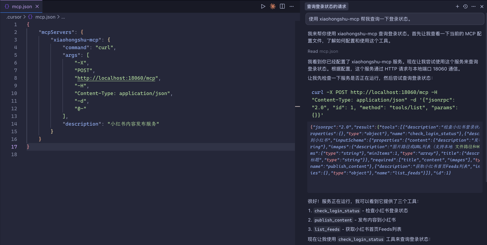

# MCP 服务接入指南

本文档介绍如何在各种 AI 客户端中接入小红书 MCP 服务。

## 🚀 快速开始

### 1. 启动 MCP 服务

```bash
# 启动服务（默认无头模式）
go run .

# 或者有界面模式
go run . -headless=false
```

服务将运行在：`http://localhost:18060/mcp`

### 2. 验证服务状态

```bash
# 测试 MCP 连接
curl -X POST http://localhost:18060/mcp \
  -H "Content-Type: application/json" \
  -d '{"jsonrpc":"2.0","method":"initialize","params":{},"id":1}'
```

## 📱 客户端接入

### Claude Desktop

**重要提示**：Claude Desktop 主要支持 stdio 类型的 MCP 服务器，对于 HTTP 服务器的支持有限。建议使用其他客户端如 VSCode 或 Cursor 来连接 HTTP MCP 服务器。

如果要在 Claude Desktop 中使用，需要通过代理的方式：

在 `~/.config/claude-desktop/claude_desktop_config.json` 中添加：

```json
{
  "mcpServers": {
    "xiaohongshu": {
      "command": "curl",
      "args": [
        "-X", "POST",
        "http://localhost:18060/mcp",
        "-H", "Content-Type: application/json",
        "-d", "@-"
      ],
      "env": {}
    }
  }
}
```

**配置路径**：
- **macOS**: `~/Library/Application Support/Claude/claude_desktop_config.json`
- **Windows**: `%APPDATA%\\Claude\\claude_desktop_config.json`

### Claude Code CLI

```bash
# 添加 HTTP MCP 服务器
claude mcp add --transport http xiaohongshu-mcp http://localhost:18060/mcp
```

### Cursor

#### 配置文件的方式

创建或编辑 MCP 配置文件：

**项目级配置**（推荐）：
在项目根目录创建 `.cursor/mcp.json`：

```json
{
  "mcpServers": {
    "xiaohongshu-mcp": {
      "command": "curl",
      "args": [
        "-X",
        "POST",
        "http://localhost:18060/mcp",
        "-H",
        "Content-Type: application/json",
        "-d",
        "@-"
      ],
      "description": "小红书内容发布服务"
    }
  }
}
```

**全局配置**：
在用户目录创建 `~/.cursor/mcp.json` (同样内容)

**Demo**



### VSCode

VSCode 从 1.102 版本开始原生支持 MCP，无需安装额外扩展。

#### 方法一：使用命令面板配置

1. 按 `Ctrl/Cmd + Shift + P` 打开命令面板
2. 运行 `MCP: Add Server` 命令
3. 选择配置范围（Workspace 或 Global）
4. 提供服务器信息：
   - **名称**: `xiaohongshu-mcp`
   - **命令**: `curl`
   - **参数**: `-X POST http://localhost:18060/mcp -H Content-Type:application/json -d @-`

#### 方法二：直接编辑配置文件

**工作区配置**（推荐）：
在项目根目录创建 `.vscode/mcp.json`：

```json
{
  "servers": {
    "xiaohongshu-mcp": {
      "command": "curl",
      "args": [
        "-X", "POST",
        "http://localhost:18060/mcp",
        "-H", "Content-Type: application/json",
        "-d", "@-"
      ],
      "description": "小红书内容发布和管理服务"
    }
  }
}
```

**全局配置**：
运行 `MCP: Open User Configuration` 命令，添加相同内容

#### 使用 MCP 工具

1. 切换到 **Agent 模式**（聊天视图中选择 Agent）
2. 点击 **Tools** 按钮查看可用工具
3. 在聊天中请求相关任务，VSCode 会自动调用相应的 MCP 工具

#### 验证连接

- 打开扩展视图，查看 **MCP SERVERS - INSTALLED** 部分
- 成功的服务器会显示绿色状态指示器

### 通用 MCP Inspector（调试用）

```bash
# 启动 MCP Inspector
npx @modelcontextprotocol/inspector

# 在浏览器中连接到：http://localhost:18060/mcp
````

## 🛠️ 可用工具

连接成功后，可使用以下 MCP 工具：

- `check_login_status` - 检查小红书登录状态
- `publish_content` - 发布图文内容到小红书
- `list_feeds` - 获取小红书首页推荐列表

## 📝 使用示例

### 检查登录状态

```json
{
  "name": "check_login_status",
  "arguments": {}
}
```

### 发布内容

```json
{
  "name": "publish_content",
  "arguments": {
    "title": "标题",
    "content": "内容描述",
    "images": ["图片URL或本地路径"]
  }
}
```

## ⚠️ 注意事项

1. **首次使用需要登录**：运行 `go run cmd/login/main.go` 完成登录
2. **网络要求**：确保客户端能访问 `localhost:18060`
3. **权限验证**：某些操作需要有效的登录状态

## 🔧 故障排除

### 连接失败

- 检查服务是否运行：`curl http://localhost:18060/health`
- 确认端口未被占用
- 检查防火墙设置

### 工具调用失败

- 确认已完成小红书登录
- 检查图片 URL 或路径是否有效
- 查看服务日志获取详细错误信息
