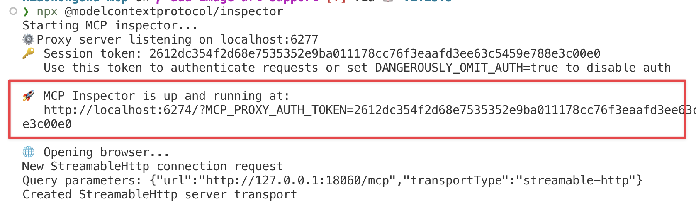
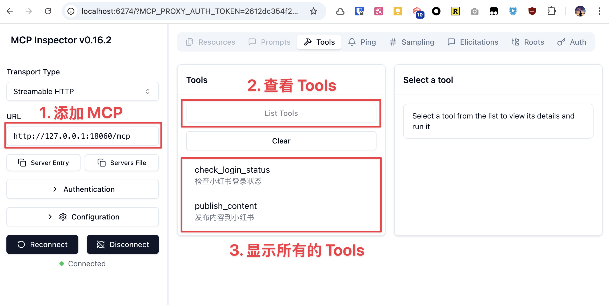

# xiaohongshu-mcp

MCP for xiaohongshu.com

## 使用教程

### 登录

第一次需要手动登录，需要保存小红书的登录状态。

运行

```bash
go run cmd/login/main.go
```

### 启动 MCP 服务

启动 xiaohongshu-mcp 服务。

```bash
go run . -headless=false
```

## 验证 MCP

```bash
npx @modelcontextprotocol/inspector
```



运行后，打开红色标记的链接，配置 MCP inspector，输入 `http://localhost:18060/mcp` ，点击 `Connect` 按钮。



按照上面配置 MCP inspector 后，点击 `List Tools` 按钮，查看所有的 Tools。

## 使用 MCP 发布

### 检查登录状态


### 发布图文

示例中是从 https://unsplash.com/ 中随机找了个图片做测试。


## MCP 集成

各种 MCP 集成工具，都可以使用这个 MCP 服务。

### Claude Cli

```bash
# localhost 是本机，如果是远程的话，更换成对应的 IP 地址。
claude mcp add --transport http xiaohongshu-mcp http://localhost:18060/mcp
```

这里使用 Claude Code With K2 做演示，接入方式参考：[在 software agents 中使用 kimi k2 模型](https://platform.moonshot.cn/docs/guide/agent-support)。

示例：

以 [Product Hunt 日报](https://product-daily.haha.ai/) 上面的一篇图片为例，使用 Claude Code 进行发布。

打开 Claude Code 后，输入：

```
帮我写一篇帖子发布到小红书上，
配图为：https://cn.bing.com/th?id=OHR.MaoriRock_EN-US6499689741_UHD.jpg&w=3840
图片是：“纽西兰陶波湖的Ngātoroirangi矿湾毛利岩雕（© Joppi/Getty Images）”

使用 xiaohongshu-mcp 进行发布。
```


高清版本可以参考：[claude-cli 进行发布](./assets/claude_push.mp4)


